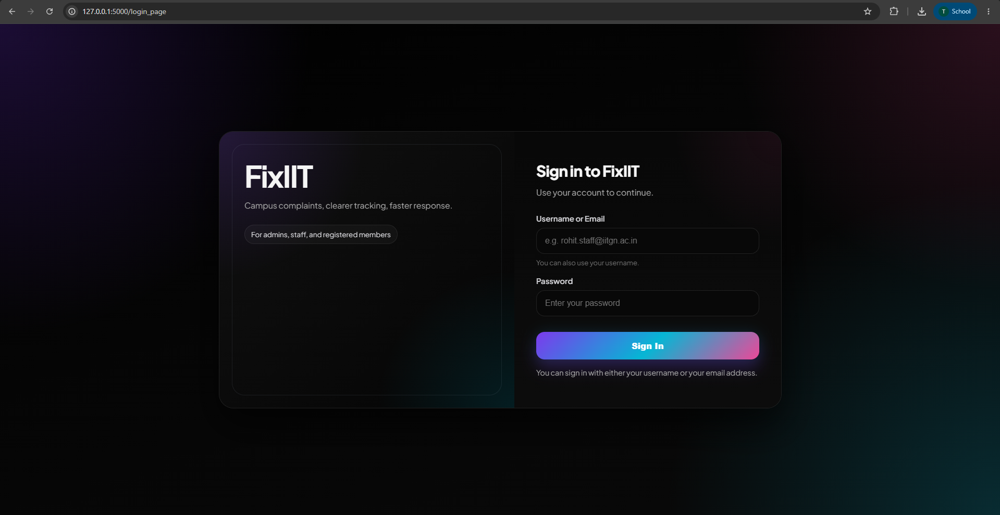
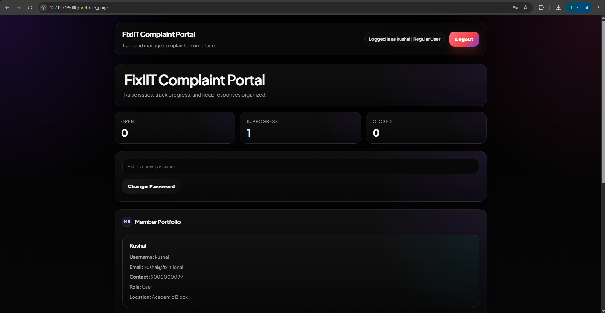
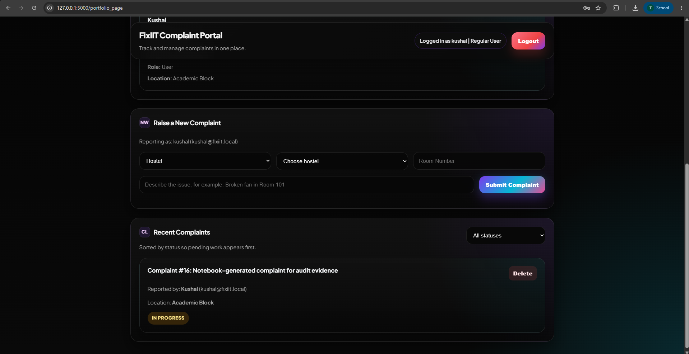
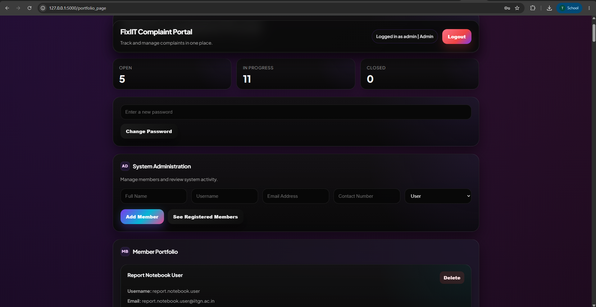

# Fixiit – Campus Complaint Management System

> 🚀 A web-based complaint management system designed to streamline the reporting, tracking, and resolution of campus maintenance issues.


---

## 📌 Overview

Fixiit is a full-stack complaint management system developed for educational institutions to simplify campus maintenance workflows. Students can report infrastructure-related issues, while staff and administrators can manage, monitor, and resolve complaints through a secure role-based platform.

The application uses JWT-based authentication, REST APIs, and a relational SQLite database to provide a structured and secure complaint management process.

> **Note:** This project was developed collaboratively as part of the **CS432 Database Management Systems** course at **IIT Gandhinagar**.

---

# ✨ Features

### 👤 Authentication

- Secure Login
- JWT Authentication
- Session Management
- Role-Based Authorization

---

### 📝 Complaint Management

- Register new complaints
- Track complaint status
- Delete complaints
- Update complaint status
- Complaint history

---

### 👥 User Roles

#### Student

- Raise complaints
- Track complaint status
- Delete own complaints

#### Staff

- View assigned complaints
- Update complaint status

#### Administrator

- Add/Delete members
- View all complaints
- Manage users
- Access audit logs

---

### 🗄 Database

- SQLite Database
- Relational Schema
- Foreign Key Constraints
- Audit Logging

---

# 🛠 Tech Stack

| Category | Technology |
|----------|------------|
| Backend | Flask |
| Language | Python |
| Frontend | HTML, CSS, JavaScript |
| Database | SQLite |
| Authentication | JSON Web Tokens (JWT) |

---

# 📂 Project Structure

```text
FixIIT
│
├── .gitignore                # Git ignore rules
├── README.md                 # Project documentation
├── images/                   # Screenshots used in README
│
├── Module_A/                 # Database design and analysis
│   ├── database/
│   ├── report.ipynb
│   └── requirements.txt
│
├── Module_B/                 # Flask web application
│   ├── app/
│   │   ├── templates/        # HTML templates
│   │   ├── app.py            # Flask application
│   │   └── local_database.db # SQLite database
│   │
│   ├── sql/                  # SQL schema and scripts
│   ├── logs/                 # Application logs
│   ├── benchmark.py
│   └── requirements.txt
```

---

# 🚀 Installation

Clone the repository

```bash
git clone https://github.com/tejas-pd/FixIIT.git
```

Move to the backend folder

```bash
cd Module_B
```

Install dependencies

```bash
pip install -r requirements.txt
```

Run the Flask server

```bash
python app/app.py
```

Open your browser

```
http://127.0.0.1:5000/login_page
```

---

# 📷 Screenshots

## Login Page



---

## Complaint Dashboard



---

## Complaint Submission



---

## Admin Panel



---

# ⭐ Key Highlights

- RESTful API Architecture
- JWT Authentication
- Role-Based Access Control
- Complaint Tracking System
- SQLite Database Integration
- Audit Logging
- CRUD Operations
- Secure Backend using Flask

---

# 🚀 Future Enhancements

- Email notifications
- Image uploads with complaints
- Complaint priority prediction
- Mobile responsive interface
- Analytics dashboard
- Cloud deployment
- Push notifications

---

# 👨‍💻 Team

This application was developed collaboratively as part of the **CS432 Database Management Systems** course at **Indian Institute of Technology Gandhinagar**.

---

# 🙋 My Contributions

- Contributed to backend development using Flask.
- Assisted in database integration and SQL operations.
- Worked on complaint management functionality.
- Participated in testing and debugging.

---

# 📄 License

This project was developed for educational purposes as part of an academic course.